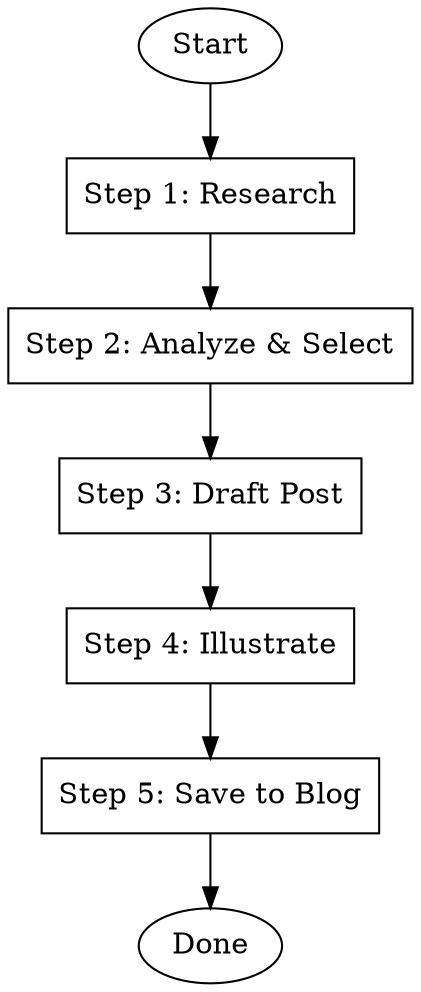

# AI News to Blog

Research latest AI/Data news from reputable sources and draft blog posts matching your writing style.

## Workflow Overview



---

## Step 1: Research Latest AI/Data News

### 1.1 Search Strategy

Search multiple reputable sources for latest AI/Data updates:

| Source Type | Examples | Search Focus |
|-------------|----------|--------------|
| **Official Blogs** | OpenAI, Anthropic, Google DeepMind, Meta AI, Microsoft AI | Product releases, research papers |
| **Tech News** | The Verge, TechCrunch, Ars Technica, Wired | Industry analysis, announcements |
| **Developer Platforms** | Hugging Face, LangChain, LlamaIndex | Tools, frameworks, tutorials |
| **Research** | arXiv, Papers With Code | Breakthrough papers |
| **Influencers** | Andrew Ng, Andrej Karpathy, Yann LeCun | Insights, commentary |
| **Chinese Sources** | 机器之心, 量子位, AI科技评论 | CN community perspective |

### 1.2 Search Queries

Run parallel web searches:

```
- "AI news [current week/month] [year]"
- "LLM release announcement [current month]"
- "AI agent framework update [year]"
- "machine learning breakthrough [current month]"
- "OpenAI Anthropic Google AI announcement"
- "open source LLM release"
```

### 1.3 Gather Top 5 Candidates

For each candidate, capture:
- **Title**: What's the news about
- **Source**: Where it's from (credibility matters)
- **Date**: How recent
- **Summary**: 2-3 sentence overview
- **Why Notable**: Impact, novelty, relevance
- **URL**: Original source

---

## Step 2: Analyze & Select Best Material

### 2.1 Evaluation Criteria

| Criterion | Weight | Description |
|-----------|--------|-------------|
| **Timeliness** | High | Published within last 7 days preferred |
| **Impact** | High | Significant industry/developer impact |
| **Depth** | Medium | Has enough substance for a post |
| **Audience Fit** | High | Relevant to AI/Data practitioners |
| **Uniqueness** | Medium | Not already widely covered |

### 2.2 Selection Process

Present top 5 to user with analysis:

```
## Top 5 AI/Data News This Week

### 1. [Title]
- Source: [source] | Date: [date]
- Summary: [2-3 sentences]
- Blog Potential: [High/Medium/Low] - [reason]

### 2. [Title]
...
```

**Use AskUserQuestion** to confirm which 1-2 topics to draft:
- Option 1: [Topic 1 title] (Recommended if highest potential)
- Option 2: [Topic 2 title]
- Option 3: [Topic 3 title]
- Option 4: Combine multiple into roundup post

---

## Step 3: Draft Blog Post

### 3.1 Read Existing Blog Style

Before drafting, read 2-3 recent posts from the blog to match:
- Tone (technical but accessible)
- Structure (clear headers, code blocks where relevant)
- Length (typically 800-1500 words)
- Language (English or Chinese based on topic)

Reference posts location: `/home/demouser/projects/fd-blog/posts/ai/`

### 3.2 Writing Style Guidelines

**For Technical Posts:**
- Clear, natural voice from a tech person
- Start with context/why this matters
- Break down complex concepts
- Include practical implications
- End with forward-looking thoughts

**Sentence Rhythm (from user's guidelines):**
- Alternate long and short sentences naturally
- Long sentences for atmosphere, context, technical explanation
- Short sentences for emphasis, conclusions, key points
- Avoid marketing/clickbait style

**Emotional Expression:**
- Immersive description using sensory details
- Restrained but genuine enthusiasm
- No excessive exclamation marks or "Wow!"
- Light, controlled humor when appropriate

### 3.3 Post Structure

```markdown
---
title: [Descriptive title]
date: YYYY-MM-DD
description: [1-2 sentence summary for SEO]
category: ai
tags: [relevant, comma, separated, tags]
cover: /covers/YYYYMMDD_[slug].webp
slug: [descriptive-slug]
published: false
---

[Opening hook - why this matters now]

---

### [Section 1: Context/Background]
[Set the scene, explain why this is significant]

---

### [Section 2: What's New]
[Core content, technical details]

---

### [Section 3: Implications/Analysis]
[Your perspective as AI/Data practitioner]

---

### [Section 4: Looking Ahead]
[Future implications, what to watch]

---

### Wrapping Up
[Concise conclusion with takeaway]

[Optional: Source links]
```

### 3.4 Language Selection

**Use AskUserQuestion:**
- English (Recommended for international topics)
- Chinese 中文 (For CN-focused topics or CN sources)
- Bilingual (Both versions)

---

## Step 4: Illustrate the Post

### 4.1 Generate Cover Image (REQUIRED)

**Every post needs a cover image.** Generate before article illustrations.

**Cover prompt guidelines:**
- Abstract/conceptual representation of the topic
- Suitable for social sharing (will be cropped to various ratios)
- Clean, professional aesthetic matching blog style
- No text in the image (title overlays handled by blog)

**Generate cover:**
```bash
npx -y bun ~/.claude/skills/image-gen/scripts/main.ts \
  --prompt "[cover prompt based on article topic]" \
  --image /home/demouser/projects/fd-blog/public/covers/YYYYMMDD_[slug].png \
  --ar 16:9 --quality 2k
```

### 4.2 Generate Article Illustrations

**Invoke skill:** `article-illustrator`

Follow article-illustrator workflow to:
1. Analyze post for illustration positions
2. Generate appropriate images to **public/images/YYYYMMDD_[slug]/** folder
3. Insert image references into the post

**Recommended settings for AI news posts:**
- Type: `infographic` or `framework`
- Style: `notion` or `blueprint`
- Density: `balanced` (3-5 images)

### 4.3 Convert All Images to WebP (REQUIRED)

**Immediately after generating each image**, convert to WebP with HIGH QUALITY settings:

```bash
# For diagrams/infographics with text - use HIGH quality (90%) and larger width
npx -y sharp-cli -i input.png -o output.webp -f webp -q 90 -- resize 1600

# For cover images - standard quality is fine
npx -y sharp-cli -i input.png -o output.webp -f webp -q 88 -- resize 1200

# Delete original PNG after successful conversion
rm input.png
```

**Quality Guidelines:**

| Image Type | Quality | Width | Why |
|------------|---------|-------|-----|
| Diagrams/Infographics | 90% | 1600px | Text must be sharp and readable |
| Framework/Architecture | 90% | 1600px | Labels and connections must be clear |
| Cover images | 88% | 1200px | No text, aesthetic focus |
| Scene/Abstract | 85% | 1200px | No fine details needed |

**Target file sizes:**
- Cover images: < 120KB
- Article images with text: < 200KB (quality over size)
- Article images without text: < 150KB

**Image Output Locations (all WebP):**
- Cover image: `/home/demouser/projects/fd-blog/public/covers/YYYYMMDD_[slug].webp`
- Article images: `/home/demouser/projects/fd-blog/public/images/YYYYMMDD_[slug]/`

---

## Step 5: Save to Blog (Direct Publishing)

### 5.1 Determine Category Path

Based on content, select the appropriate category:

| Category | Path | Use For |
|----------|------|---------|
| AI/Agent | `posts/ai/agent/` | AI agents, frameworks, autonomy |
| AI/Model | `posts/ai/model/` | Model releases, comparisons |
| AI/Data | `posts/ai/data/` | Data engineering + AI |
| AI/RAG | `posts/ai/rag/` | RAG, retrieval, knowledge bases |
| Dev | `posts/dev/` | Development tools, coding |

### 5.2 File & Folder Naming Convention

**IMPORTANT:** Use consistent naming with date prefix across ALL files:

| Item | Naming Pattern | Example |
|------|----------------|---------|
| MDX file | `YYYYMMDD_[slug].mdx` | `20260129_claude_code_features.mdx` |
| Cover image | `/covers/YYYYMMDD_[slug].webp` | `/covers/20260129_claude_code_features.webp` |
| Images folder | `/images/YYYYMMDD_[slug]/` | `/images/20260129_claude_code_features/` |
| Working folder | `pre-post/YYYYMMDD_[slug]/` | `pre-post/20260129_claude_code_features/` |

**The full name `YYYYMMDD_[slug]` must be identical** across MDX filename, cover image, images folder, and working folder.

### 5.3 Verify Images (Quick Check)

**Images should already be WebP from Step 4.** Quick verification:

```bash
# Verify all images are WebP and check sizes
ls -lh public/covers/YYYYMMDD_[slug].webp
ls -lh public/images/YYYYMMDD_[slug]/*.webp
```

**Expected sizes:**
- Cover images: < 120KB
- Article images with text/diagrams: < 200KB (prioritize clarity)
- Article images without text: < 150KB

If any PNG/JPG remain, convert now using Step 4.3 commands.

### 5.4 Output Structure

```
/home/demouser/projects/fd-blog/
├── posts/ai/[category]/
│   └── YYYYMMDD_[slug].mdx              # The blog post
├── public/
│   ├── covers/
│   │   └── YYYYMMDD_[slug].webp         # Cover image (WebP!)
│   └── images/
│       └── YYYYMMDD_[slug]/             # Images folder (same name!)
│           ├── 01-framework-xxx.webp
│           └── 02-framework-yyy.webp
└── pre-post/
    └── YYYYMMDD_[slug]/                 # Working files (same name!)
        ├── outline.md
        └── prompts/
            └── illustration-[slug].md
```

**Example for `20260129_claude_code_features`:**
```
posts/ai/agent/20260129_claude_code_features.mdx
public/covers/20260129_claude_code_features.webp
public/images/20260129_claude_code_features/01-framework-hooks.webp
pre-post/20260129_claude_code_features/outline.md
```

**Note:** The `pre-post/` folder stores working files like outlines and prompts for reference/regeneration. The actual published content goes to `posts/` and `public/`.

### 5.5 Image Path References in Post

Use relative paths from public root:
```markdown

```

Cover in frontmatter:
```yaml
cover: /covers/YYYYMMDD_topic_slug.webp
```

### 5.6 Final Checklist

Before saving, verify:
- [ ] Frontmatter is complete (title, date, description, category, tags, slug)
- [ ] `published: false` is set (for review before publishing)
- [ ] Cover image exists at `/public/covers/YYYYMMDD_[slug].webp`
- [ ] All illustrations saved to `/public/images/YYYYMMDD_[slug]/` as WebP
- [ ] All images are < 150KB (cover < 100KB)
- [ ] Image paths in post are correct (`/images/YYYYMMDD_slug/filename.webp`)
- [ ] No broken links or references
- [ ] Writing style matches existing blog posts

---

## Quick Start

When user invokes this skill:

1. **Ask focus area** (if not specified):
   - General AI/LLM news
   - AI Agents & Frameworks
   - Open Source Models
   - AI in Data Engineering
   - AI Research Papers

2. **Run research** (Step 1)

3. **Present candidates & get selection** (Step 2)

4. **Draft post** (Step 3)

5. **Generate cover + Illustrate** (Step 4) - Cover to public/covers/, images to public/images/

6. **Save to posts** (Step 5) - Save MDX to posts/ai/[category]/

7. **Report completion:**
   ```
   Post saved to: /home/demouser/projects/fd-blog/posts/ai/[category]/YYYYMMDD_[slug].mdx
   Cover: /home/demouser/projects/fd-blog/public/covers/YYYYMMDD_[slug].webp
   Images: /home/demouser/projects/fd-blog/public/images/YYYYMMDD_[slug]/

   To publish:
   1. Review the post in your IDE or browser (pnpm dev)
   2. Set published: true in frontmatter
   3. Commit and push
   ```

---

## Environment Variables for Image Generation

The `image-gen` skill loads API keys from `~/.claude-skills/.env`:

```bash
# ~/.claude-skills/.env
GOOGLE_API_KEY=your-key-here
# or
OPENAI_API_KEY=your-key-here
```

Make sure the API key is configured before running this skill.
