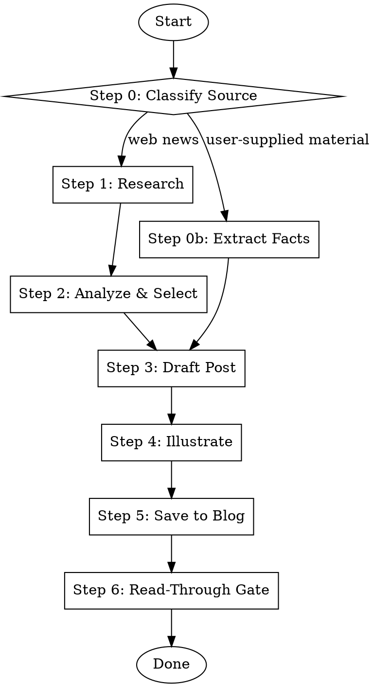

# AI News to Blog

Research latest AI/Data news from reputable sources and draft blog posts matching your writing style.

## Workflow Overview


```dot
digraph workflow {
    rankdir=TB;

    "Start" [shape=ellipse];
    "Step 0: Classify Source" [shape=diamond];
    "Step 1: Research" [shape=box];
    "Step 2: Analyze & Select" [shape=box];
    "Step 0b: Extract Facts" [shape=box];
    "Step 3: Draft Post" [shape=box];
    "Step 4: Illustrate" [shape=box];
    "Step 5: Save to Blog" [shape=box];
    "Step 6: Read-Through Gate" [shape=box];
    "Done" [shape=ellipse];

    "Start" -> "Step 0: Classify Source";
    "Step 0: Classify Source" -> "Step 1: Research" [label="web news"];
    "Step 0: Classify Source" -> "Step 0b: Extract Facts" [label="user-supplied material"];
    "Step 1: Research" -> "Step 2: Analyze & Select";
    "Step 2: Analyze & Select" -> "Step 3: Draft Post";
    "Step 0b: Extract Facts" -> "Step 3: Draft Post";
    "Step 3: Draft Post" -> "Step 4: Illustrate";
    "Step 4: Illustrate" -> "Step 5: Save to Blog";
    "Step 5: Save to Blog" -> "Step 6: Read-Through Gate";
    "Step 6: Read-Through Gate" -> "Done";
}
```

---

## Step 0: Classify the Source (DO THIS FIRST)

There are two entry paths. Picking the wrong one is the most expensive mistake in this
workflow, because Steps 1-2 assume you are hunting for material you have not seen yet.

| Input | Path |
|---|---|
| "find AI news", "what's new", weekly curation | **Web path** → Step 1 |
| User attaches a transcript, chat log, notes, their own experience, or a specific article | **Supplied-material path** → Step 0b, then skip to Step 3 |
| User's own life: memories, places, music, emotional reflections, in messy spoken style | **Not this skill** → use `oral-to-memoir` instead |

Boundary with `oral-to-memoir`: that skill owns personal-life content destined to become
散文 (memoir essays). This skill's supplied-material path owns technical/AI material —
experiment logs, debugging sessions, claims to verify, articles to respond to. If the
material is the user's life, stop here and switch skills; if it is the user's *work*,
continue.

On the supplied-material path, **skip Step 1/2 candidate hunting** — the material is the
source of truth for the narrative; your job is fidelity, not discovery.

**Exception: verify external factual claims independently.** Step 1/2 exist to find
*topics*; they say nothing about fact-checking. Any third-party claim the article will
rely on or argue against (vendor numbers, CLI budgets, API limits, dates) still gets
verified against primary sources — web research included. Supplied material tells you
what the story is; it does not make its embedded claims true.

---

## Step 0b: Extract Facts Before Outlining (supplied-material path only)

**Do not write an outline from your mental summary of the material.** Paraphrase drifts,
and every drift becomes a rewrite later. Build a fact sheet first, quoting the source.

**Do not pick a slug yet.** The thesis is still forming, and a slug chosen now will
contradict the finished article (see Step 6.3). Use a provisional working folder
`pre-post/YYYYMMDD_wip/` and rename it at Step 5.2 once the conclusion is settled.

Write `pre-post/YYYYMMDD_wip/facts.md`:

```markdown
## 被反驳/被讨论的主张（逐字引用，不要转述）
> "<exact sentence from the source>"
- 是泛指还是有具体对象？谁是被告？有没有对照组？
- 是观察值（"涨到了 X"）还是建议阈值（"别超过 X"）？这两者的反驳方式完全不同。

## 方法（谁做了什么，按顺序）
- 谁出题 / 谁答题 / 谁判卷？三者是否是同一个主体？
- 每一轮为什么作废？换了什么变量？

## 数字（照抄，带单位和上下文）
| 数字 | 含义 | 出处 |

## 时间线
## 明确没有被测到 / 没有被证明的部分
```

**Confirm with AskUserQuestion before drafting — but only when the stakes warrant it.**

Ask when ANY of these holds:
- the article will argue against a claim (scope errors here flip the whole piece)
- the material describes an experiment or multi-actor process (roles get confused)
- the article's argument depends on specific numbers (measurement vs recommendation)

Ask about the 3-5 facts where a misreading would change the whole article. For simple
experience write-ups or short memos with no contested claims, skip the confirmation —
facts.md is still worth writing, but don't make the user grade it.

Cheap to ask when it matters. Misreading a claim's scope (e.g. flattening "X can't, Y can"
into "nothing can") silently deletes the article's most valuable finding and costs a
full rewrite.

---

## Step 1: Research Latest AI/Data News

### 1.1 Search Strategy

Search multiple reputable sources for latest AI/Data updates:

| Source Type | Examples | Search Focus |
|-------------|----------|--------------|
| **Official Blogs** | OpenAI, Anthropic, Google DeepMind, Meta AI, Microsoft AI | Product releases, research papers |
| **Tech News** | The Verge, TechCrunch, Ars Technica, Wired | Industry analysis, announcements |
| **Developer Platforms** | Hugging Face, LangChain, LlamaIndex | Tools, frameworks, tutorials |
| **Research** | arXiv, Papers With Code | Breakthrough papers |
| **Influencers** | Andrew Ng, Andrej Karpathy, Yann LeCun | Insights, commentary |
| **Chinese Sources** | 机器之心, 量子位, AI科技评论 | CN community perspective |

### 1.2 Search Queries

Run parallel web searches:

```
- "AI news [current week/month] [year]"
- "LLM release announcement [current month]"
- "AI agent framework update [year]"
- "machine learning breakthrough [current month]"
- "OpenAI Anthropic Google AI announcement"
- "open source LLM release"
```

### 1.3 Gather Top 5 Candidates

For each candidate, capture:
- **Title**: What's the news about
- **Source**: Where it's from (credibility matters)
- **Date**: How recent
- **Summary**: 2-3 sentence overview
- **Why Notable**: Impact, novelty, relevance
- **URL**: Original source

---

## Step 2: Analyze & Select Best Material

### 2.1 Evaluation Criteria

| Criterion | Weight | Description |
|-----------|--------|-------------|
| **Timeliness** | High | Published within last 7 days preferred |
| **Impact** | High | Significant industry/developer impact |
| **Depth** | Medium | Has enough substance for a post |
| **Audience Fit** | High | Relevant to AI/Data practitioners |
| **Uniqueness** | Medium | Not already widely covered |

### 2.2 Selection Process

Present top 5 to user with analysis:

```
## Top 5 AI/Data News This Week

### 1. [Title]
- Source: [source] | Date: [date]
- Summary: [2-3 sentences]
- Blog Potential: [High/Medium/Low] - [reason]

### 2. [Title]
...
```

**Use AskUserQuestion** to confirm which 1-2 topics to draft:
- Option 1: [Topic 1 title] (Recommended if highest potential)
- Option 2: [Topic 2 title]
- Option 3: [Topic 3 title]
- Option 4: Combine multiple into roundup post

---

## Step 3: Draft Blog Post

### 3.1 Calibrate Style Against Real Posts (BEFORE writing a single line)

**Resolve the blog root first** — never hardcode it. In order: the path the user gave →
the repo you were invoked in → `CLAUDE.md` in that repo. Do not assume `/home/demouser/…`
or any other machine's layout.

```bash
# find recent posts in the SAME LANGUAGE you are about to write in
grep -rl '^description: "[^"]*[一-鿿]' --include='*.mdx' posts   # Chinese posts
grep -rL '^description: "[^"]*[一-鿿]' --include='*.mdx' posts   # English posts
```

**Read 4 recent posts in the target language** — not 2-3, and not whichever ones are
newest regardless of language. Voice does not transfer across languages.

**If the target blog root has no published posts yet** (fresh scaffold, test fixture),
style-spec is still required — fall back to reading posts from the repo you were invoked
in (or the user's main blog), and note in style-spec.md where the samples came from.
An empty target is never a reason to skip calibration.

Then write `pre-post/YYYYMMDD_wip/style-spec.md` with concrete, checkable values:

| Dimension | Capture |
|---|---|
| Paragraph length | typical lines per paragraph; do they use one-line paragraphs as beats? |
| Section headers | plain and descriptive, or framed/clever? quote 3 real ones |
| Technical density | do they name real APIs/flags/numbers, or abstract them away? quote an example |
| Humor register | quote the funniest line in the sample. Is it a joke, or deadpan honesty? |
| Opening move | how does the first paragraph start? |
| Closing move | quote the last line of 2 posts |

**Two failure modes this prevents, both observed:**
- Writing flat/monotone because you never absorbed the author's rhythm.
- Over-correcting a style note into an extreme. "Make it understandable to non-technical
  readers" does **not** mean deleting the API names, numbers, and commands — it means
  *naming the real thing, then adding one clause of plain-language explanation*. Check the
  technical-density row before you strip anything out.

### 3.2 Writing Style Guidelines

**For Technical Posts:**
- Clear, natural voice from a tech person
- Start with context/why this matters
- Break down complex concepts
- Include practical implications
- End with forward-looking thoughts

**Sentence Rhythm (from user's guidelines):**
- Alternate long and short sentences naturally
- Long sentences for atmosphere, context, technical explanation
- Short sentences for emphasis, conclusions, key points
- Avoid marketing/clickbait style

**Emotional Expression:**
- Immersive description using sensory details
- Restrained but genuine enthusiasm
- No excessive exclamation marks or "Wow!"
- Light, controlled humor when appropriate

### 3.3 Post Structure

```markdown
---
title: [Descriptive title]
date: YYYY-MM-DD
description: [1-2 sentence summary for SEO]
category: ai
tags: [relevant, comma, separated, tags]
cover: /covers/YYYYMMDD_[slug].webp
slug: [descriptive-slug]
published: false
---

[Opening hook - why this matters now]

---

### [Section 1: Context/Background]
[Set the scene, explain why this is significant]

---

### [Section 2: What's New]
[Core content, technical details]

---

### [Section 3: Implications/Analysis]
[Your perspective as AI/Data practitioner]

---

### [Section 4: Looking Ahead]
[Future implications, what to watch]

---

### Wrapping Up
[Concise conclusion with takeaway]

[Optional: Source links]
```

### 3.4 Language Selection

**Check what the blog can actually do before offering options.** Grep for `lang` /
`locale` / `i18n` handling and for an `alternates.languages` (hreflang) map in the post
metadata. If there is none, "bilingual" is not a feature — it is two separate posts that
will both appear in the post list, RSS, and sitemap as near-duplicates.

**Use AskUserQuestion:**
- English (for international topics)
- Chinese 中文 (for CN-focused topics or CN sources)
- Bilingual — **only offer this with the mechanics spelled out**: two independent MDX files
  with distinct slugs plus a manual cross-link line, unless i18n exists in the repo.

Default to a single language when the post continues a series already written in that
language — the callback to the earlier post matters more than reach.

---

## Step 4: Illustrate the Post

### 4.1 Two-Tier Cost Optimization

**Use different providers for different image types** to reduce costs by 80%+:

| Image Type | Provider | Cost | When to Use |
|------------|----------|------|-------------|
| Cover (no text) | Replicate FLUX | $0.003 | Abstract, atmospheric, visual-only |
| Diagrams/infographics | Google Gemini | $0.039 | Any image with text labels |

**Rule**: If the image has readable text → Google. If purely visual → Replicate.

### 4.2 Generate Cover Image (REQUIRED)

**Every post needs a cover image.** Generate FIRST using Replicate (13x cheaper).

**Cover prompt guidelines:**
- Abstract/conceptual representation of the topic
- Suitable for social sharing (will be cropped to various ratios)
- Clean, professional aesthetic matching blog style
- **No text in the image** (title overlays handled by blog) → Use Replicate

**Generate cover with Replicate FLUX ($0.003):**
```bash
npx -y bun ~/.claude/plugins/cache/fd-skills-marketplace/fd-skills/1.0.0/skills/image-gen/scripts/main.ts \
  --prompt "[abstract visual prompt, no text]" \
  --image $BLOG_ROOT/public/covers/YYYYMMDD_[slug].webp \
  --provider replicate --ar 16:9
```

### 4.3 Generate Article Illustrations

**Invoke skill:** `article-illustrator` OR generate directly with image-gen

For diagrams/infographics with text labels, use Google at 1K ($0.039 each):
```bash
npx -y bun ~/.claude/plugins/cache/fd-skills-marketplace/fd-skills/1.0.0/skills/image-gen/scripts/main.ts \
  --prompt "[diagram with labeled components]" \
  --image $BLOG_ROOT/public/images/YYYYMMDD_[slug]/01-infographic-xxx.png
```
Note: 1K source resolution is default and sufficient - after WebP compression to 1600px, quality is indistinguishable from 2K.

**Recommended settings for AI news posts:**
- Type: `infographic` or `framework`
- Style: `notion` or `blueprint`
- Density: `balanced` (3-5 images)

**Keep each diagram under ~5 labelled elements.** Generation accuracy falls off sharply
past that. A timeline with 4 lanes × 3 markers will come back with the lanes mislabelled;
the same idea as 1 line + 3 markers comes back correct. Split rather than cram.

#### Verify every generated diagram before using it (REQUIRED)

**`Read` each generated image back and check the content, not just the layout.** Typos in
AI-rendered text are a known, acceptable tradeoff. Wrong numbers and inverted logic are
not — especially in a post that argues about facts.

Check, in this order:
1. **Numbers** — does every figure match the article? (Observed failure: `400,000`
   rendered as `4000`.)
2. **Logic direction** — does the diagram assert the same thing the text does? (Observed
   failure: a timeline marked the main session as *finished* before the cut-off, the exact
   opposite of the article's point.)
3. **Element count** — did it invent a duplicate bar/row/box?
4. **Relative positions** — are thresholds, cut-off lines, and comparisons on the correct
   side of each other?

If any of these is wrong, **re-generate with fewer elements** rather than accepting it.
Only then convert to WebP.

**Do not write the alt text from the prompt you sent — write it from the image you got back.**

### 4.4 Convert All Images to WebP (REQUIRED)

**Immediately after generating each image**, convert to WebP:

```bash
# For diagrams/infographics with text - HIGH quality, larger width
npx -y sharp-cli -i input.png -o output.webp -f webp -q 90 -- resize 1600

# For cover images from Replicate (already WebP if using .webp extension)
# If PNG, convert with standard quality
npx -y sharp-cli -i input.png -o output.webp -f webp -q 88 -- resize 1200

# Delete original PNG after successful conversion
rm input.png
```

**Quality Guidelines:**

| Image Type | Quality | Width | Provider | Cost |
|------------|---------|-------|----------|------|
| Cover images (no text) | 88% | 1200px | Replicate | $0.003 |
| Diagrams/Infographics | 90% | 1600px | Google | $0.039 |
| Framework/Architecture | 90% | 1600px | Google | $0.039 |
| Scene/Abstract (no text) | 85% | 1200px | Replicate | $0.003 |

**Target file sizes:**
- Cover images: < 120KB
- Article images with text: < 200KB (quality over size)
- Article images without text: < 150KB

**Cost Example (typical post):**
- Old: 1 cover + 3 diagrams + 1 re-roll @ $0.134 each = **$0.67**
- New: 1 cover @ $0.003 + 4 diagrams @ $0.039 each = **$0.16** (76% savings)

**Image Output Locations (all WebP):**
- Cover image: `$BLOG_ROOT/public/covers/YYYYMMDD_[slug].webp`
- Article images: `$BLOG_ROOT/public/images/YYYYMMDD_[slug]/`

---

## Step 5: Save to Blog (Direct Publishing)

### 5.1 Determine Category Path

Based on content, select the appropriate category:

| Category | Path | Use For |
|----------|------|---------|
| AI/Agent | `posts/ai/agent/` | AI agents, frameworks, autonomy |
| AI/Model | `posts/ai/model/` | Model releases, comparisons |
| AI/Data | `posts/ai/data/` | Data engineering + AI |
| AI/RAG | `posts/ai/rag/` | RAG, retrieval, knowledge bases |
| Dev | `posts/dev/` | Development tools, coding |

### 5.2 File & Folder Naming Convention

**IMPORTANT:** Use consistent naming with date prefix across ALL files:

| Item | Naming Pattern | Example |
|------|----------------|---------|
| MDX file | `YYYYMMDD_[slug].mdx` | `20260129_claude_code_features.mdx` |
| Cover image | `/covers/YYYYMMDD_[slug].webp` | `/covers/20260129_claude_code_features.webp` |
| Images folder | `/images/YYYYMMDD_[slug]/` | `/images/20260129_claude_code_features/` |
| Working folder | `pre-post/YYYYMMDD_[slug]/` | `pre-post/20260129_claude_code_features/` |

**The full name `YYYYMMDD_[slug]` must be identical** across MDX filename, cover image, images folder, and working folder.

**Pick the slug here, not earlier** — by this point the conclusion is settled, so the slug
can describe what the article actually says. Rename the provisional `pre-post/YYYYMMDD_wip/`
folder to match. If the thesis shifts after this point, Step 6.3 will catch it; renaming all
four locations then is cheap as long as the post is still `published: false`.

### 5.3 Verify Images (Quick Check)

**Images should already be WebP from Step 4.** Quick verification:

```bash
# Verify all images are WebP and check sizes
ls -lh public/covers/YYYYMMDD_[slug].webp
ls -lh public/images/YYYYMMDD_[slug]/*.webp
```

**Expected sizes:**
- Cover images: < 120KB
- Article images with text/diagrams: < 200KB (prioritize clarity)
- Article images without text: < 150KB

If any PNG/JPG remain, convert now using Step 4.3 commands.

### 5.4 Output Structure

```
$BLOG_ROOT/
├── posts/ai/[category]/
│   └── YYYYMMDD_[slug].mdx              # The blog post
├── public/
│   ├── covers/
│   │   └── YYYYMMDD_[slug].webp         # Cover image (WebP!)
│   └── images/
│       └── YYYYMMDD_[slug]/             # Images folder (same name!)
│           ├── 01-framework-xxx.webp
│           └── 02-framework-yyy.webp
└── pre-post/
    └── YYYYMMDD_[slug]/                 # Working files (same name!)
        ├── outline.md
        └── prompts/
            └── illustration-[slug].md
```

**Example for `20260129_claude_code_features`:**
```
posts/ai/agent/20260129_claude_code_features.mdx
public/covers/20260129_claude_code_features.webp
public/images/20260129_claude_code_features/01-framework-hooks.webp
pre-post/20260129_claude_code_features/outline.md
```

**Note:** The `pre-post/` folder stores working files like outlines and prompts for reference/regeneration. The actual published content goes to `posts/` and `public/`.

### 5.5 Image Path References in Post

Use relative paths from public root:
```markdown

```

Cover in frontmatter:
```yaml
cover: /covers/YYYYMMDD_topic_slug.webp
```

### 5.6 Mechanical Checklist

These are the file-level checks. Narrative checks are Step 6 and are **not** optional.

- [ ] Frontmatter is complete (title, date, description, category, tags, slug)
- [ ] `published: false` is set (for review before publishing)
- [ ] Cover image exists at `/public/covers/YYYYMMDD_[slug].webp`
- [ ] All illustrations saved to `/public/images/YYYYMMDD_[slug]/` as WebP
- [ ] All images are < 150KB (cover < 100KB)
- [ ] Image paths in post are correct (`/images/YYYYMMDD_slug/filename.webp`)
- [ ] Internal `/posts/...` links resolve to a **published** post, not a draft
- [ ] The content parser accepts the file (e.g. `npx contentlayer build` — confirm the
      document count went up by one, and that tables/code blocks/quotes compiled)

---

## Step 6: Read-Through Gate (REQUIRED before reporting done)

Everything above is written and checked **section by section**. Almost every defect that
survives to this point is a whole-document defect, invisible from inside a single section.

**Read the post start to finish, once, as someone who has never seen the material.**
Not a skim, not a grep. Then answer each of these in writing:

#### 6.1 Setup before payoff
- [ ] Every **proper noun** (your own tools, products, model names) is introduced the first
      time it appears — one clause is enough, plus a link to an earlier post if one exists.
- [ ] Every **number or claim that gets refuted later** was stated up front. If a section
      opens with "顺便 / by the way / also worth noting", that is a smell: either it was
      never set up, or it does not belong.
- [ ] Every callback ("回到开头…", "as I said earlier") has a real antecedent.
- [ ] Any figure/table is preceded by the premise it illustrates — what was the task, what
      do the columns mean, what does a correct answer look like?

#### 6.2 Claim fidelity (supplied-material path)
- [ ] Re-open `facts.md`. Does the article still state the original claim with its **exact
      scope**? Not broadened into a general truth, not narrowed. Check especially whether a
      claim about *one named subject vs another* got flattened into a claim about the
      category.
- [ ] Is every number still the kind of number it was — a measurement vs a recommended
      threshold? The rebuttal only works against the right kind.

#### 6.3 Naming still matches the conclusion
- [ ] Does the **slug** still describe what the finished article says? Slugs get chosen
      early, when the thesis is still forming, and are never revisited. (Observed failure:
      a slug saying "three voided probes" on an article whose text says two were voided and
      the third stood.)
- [ ] `YYYYMMDD_[slug]` is identical across MDX filename, cover, images folder, pre-post
      folder. **If the slug changed, rename all four.**
- [ ] Title, description, and H2/H3 headers agree with the conclusion.

#### 6.4 Register
- [ ] Compare against `style-spec.md`. Technical density in range — real names and numbers
      present, each with a plain-language clause where needed.
- [ ] No meta-commentary about the article's own rhetorical structure.
- [ ] Section headers are descriptive, not clever.

#### 6.5 Honest reporting
- [ ] Anything you could **not** verify is stated as unverified — in the post where it
      affects a conclusion, and to the user in your completion report.
- [ ] If the post argues against someone, the limits of what you actually tested are stated
      explicitly.
- [ ] If you could not preview the rendered page, **say so plainly** rather than implying
      it was checked.

---

## Quick Start

When user invokes this skill:

0. **Classify the source** (Step 0). Attached transcript / notes / a specific article →
   supplied-material path: run Step 0b, then jump to Step 3. Otherwise → web path.

0b. **Extract facts; confirm with AskUserQuestion only if** the article argues against a
   claim, involves experiments/roles, or leans on specific numbers (Step 0b).

1. **Ask focus area** (web path only, if not specified):
   - General AI/LLM news
   - AI Agents & Frameworks
   - Open Source Models
   - AI in Data Engineering
   - AI Research Papers

2. **Run research + present candidates & get selection** (Steps 1-2, web path only)

3. **Calibrate style, then draft** (Step 3) - read 4 recent posts in the target language
   and write `style-spec.md` BEFORE the first line of prose

4. **Generate cover + Illustrate** (Step 4) - cover to public/covers/, images to
   public/images/, and `Read` every diagram back to verify numbers and logic

5. **Save to posts** (Step 5) - MDX to posts/ai/[category]/, then the mechanical checklist

6. **Read-through gate** (Step 6) - read it once end to end as a new reader. Do not skip
   this because the sections all looked fine individually; that is exactly when it fails.

7. **Report completion:**
   ```
   Post saved to: $BLOG_ROOT/posts/ai/[category]/YYYYMMDD_[slug].mdx
   Cover: $BLOG_ROOT/public/covers/YYYYMMDD_[slug].webp
   Images: $BLOG_ROOT/public/images/YYYYMMDD_[slug]/

   Verified: <parser build / link resolution / diagram fact-check>
   NOT verified: <anything you could not check — say it plainly, e.g. "no browser preview:
                 dev server would not start in this environment">

   To publish:
   1. Review the post in your IDE or browser (check the repo's own dev command in
      CLAUDE.md — it may not be `pnpm dev`)
   2. Set published: true in frontmatter
   3. Commit and push (only when the user asks)
   ```

---

## Environment Variables for Image Generation

The `image-gen` skill loads API keys from `~/.claude-skills/.env`:

```bash
# ~/.claude-skills/.env
GOOGLE_API_KEY=your-key-here       # For diagrams/infographics with text ($0.039)
REPLICATE_API_TOKEN=your-token     # For covers/aesthetic images ($0.003)
```

**Cost optimization**: Having both keys enables two-tier provider selection:
- Cover images (no text) → Replicate at $0.003 (13x cheaper)
- Diagrams with text → Google at $0.039 (best text rendering)

Make sure at least one API key is configured before running this skill.
