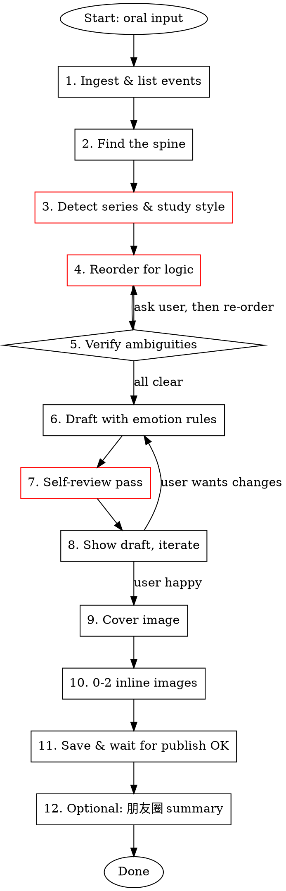
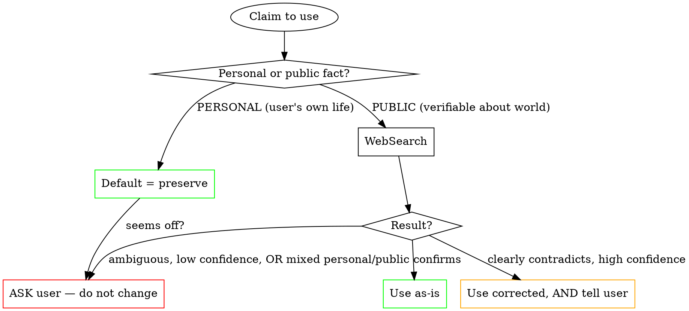

# Oral → Memoir Essay

Turn the user's scattered oral narration into a polished, emotionally dense Chinese 散文, in the voice of the existing blog's series (e.g. `music_mem`).

This skill is the result of multiple revision rounds. Every step here exists because **a first draft failed in a specific way** during a real session. Follow it.

---

## Workflow Overview



Steps marked **red** are the ones that, when skipped, caused the most rework in past sessions. Do not skip them.

---

## Step 1 — Ingest & List Events

Before writing **anything**, read the entire oral input and extract every distinct memory / scene into a flat list. Do this in your head or in a scratch TodoWrite — the goal is to have the raw material visible.

For each event capture:

| field | example |
|---|---|
| time marker | "在北京友邦工作时", "MBA 第二年", "上周" |
| location | 北京 / 上海 / 都柏林 |
| people | 教练、楼总、护士长、HR 小姑娘 |
| object/song | 飞得更高、小金狗、奥迪 A4 |
| user's exact phrase worth preserving | "请把我埋在新闻联播里" |
| emotional tone | 羡慕 / 怅然 / 滑稽 / 自嘲 |

Do **not** start writing prose at this stage. The temptation is to draft inline; resist it.

---

## Step 2 — Find the Spine

Identify three things:

1. **The recurring motif** — what physical object / song / place threads through every scene? (e.g. 《春天里》)
2. **The trigger** — what tiny moment in the *present* set off this entire memory chain? (e.g. 嗨捞火锅店里听到这首歌)
3. **The emotional arc** — nostalgia? regret? grateful disbelief? wry self-mockery? Usually a *blend* — name the dominant note and the secondary note.

The spine determines the **frame**: trigger (now) → memory chain → return to now. The closing must echo the opening.

---

## Step 3 — Detect Series & Study Style (MANDATORY)

This is the step that, when skipped, produces "first draft has no voice."

### 3.1 Detect the series

Look at the user's hint phrases:
- "music memory" / "音乐与记忆" → `music_mem` series, `posts/thoughts/reminiscing/`
- 旅行 / 自驾 → check for travel series in `posts/thoughts/`
- 读书笔记 → `posts/reading/`
- if uncertain — list candidate series and ask

### 3.2 Read the latest 1–2 posts in the SAME series

```bash
ls /Users/party/projects/fd-blog/posts/thoughts/reminiscing/ | grep music_mem | tail -2
```

Read both files in full. Then write a short style note (in the working folder or in your scratch context) capturing:

- **Title pattern** — e.g. `音乐与记忆 N：A，B，和C` (three vivid images joined by 和)
- **Section divider** — `---` between scenes
- **Header style** — `### ` with short evocative names, not numbered
- **Opening rhythm** — usually 3 short sentences, then a beat
- **Sentence cadence** — alternating long descriptive + short impact sentences
- **Self-deprecation level** — how often does the narrator turn the lens on himself?
- **Closing technique** — does the series tend to use a *picture* close (画面收) or a *list* close (point-naming people) or a *one-liner* close?
- **Quirks** — second-person "你" interjections, signature word choices, signature punctuation

**Do NOT begin drafting until you have done this read.** The "voice" of the series is loaded from these files, not from your training data.

### 3.3 What NOT to use as style reference

- Posts in other series (e.g. don't use a `posts/ai/` post to inform a `music_mem` post — they have totally different voices)
- Posts the user has flagged as weak
- Posts older than 6 months (voice may have evolved)

---

## Step 4 — Reorder for Logic (MANDATORY)

The single biggest source of rework: **scattered oral narration almost always violates motivation-before-action ordering.**

### 4.1 The motivation-before-action rule

If the user says (in order):
1. "I learned to drive in Shanghai..."
2. "...the coach was funny..."
3. "...by the way, the reason I learned was so I could drive to my MBA classes."

You MUST restructure to:
1. "I was doing an MBA in Shanghai. Commuting was painful. I wanted a car." ← motivation
2. "Only one problem: I didn't have a license." ← obstacle
3. "I learned to drive..." ← action
4. "...the coach was funny..." ← detail

The reader needs to know **why** before reading **what**. Always.

### 4.2 The frame rule

Every personal essay should follow:

```
[trigger in the present, 1-3 short paragraphs]
---
[memory chain — chronological or thematic, with section breaks]
---
[return to the present, ideally echoing the opening image]
```

The closing image must *literally* call back to something in the opening (e.g. opening "锅子刚开始翻滚" → closing "汤上来的时候，已经看不见那些东西了，但我知道它们一直在锅底").

### 4.3 Chronology check on people / companies / places

Every time the narration references "when I was at X" or "I had left X" — write it down on a quick timeline. Look for inconsistencies. Real example from past session: narration mentioned "惠普的工作机制非常松" — first draft made it sound like the narrator was *currently* at HP during the MBA, but actually he had already left HP. Big difference. The "想回去 HP 的怅惘" was the whole emotional point.

Always ask: "at the time of [event], was the narrator at company X or already gone?"

---

## Step 5 — Verify Ambiguities AND Fact-Check Before Drafting

This step is two halves: (a) ask the user about **internal** contradictions, and (b) **actively verify** external facts that you can check yourself.

### 5.1 Ambiguities — ask the user

If after Step 4 you have any of:
- Conflicting internal timeline ("you said you were at HP, but also at 友邦 in 2008?")
- Missing critical detail (year of an event that anchors emotion)
- Ambiguous pronouns (whose 老婆? which 同事?)

**Use `AskUserQuestion`** to resolve before drafting. Do not silently guess.

### 5.2 Fact-check — but distinguish PERSONAL from PUBLIC facts

Oral narration can contain two very different categories of "facts," and they need opposite treatment.

**Public facts** (verifiable on the open web) — verify them, and if the user is wrong about a public fact, gently correct (and tell them).

**Personal facts** (the user's own lived experience: where they worked, which road their office was on, the name of a coworker, what year their kid was born) — **the user is the authority. Period.** You don't get to "correct" their memory of their own life based on what *seems plausible* to you. If something sounds odd, you can quietly check the web for confirmation, but if the web doesn't confirm or contradict cleanly — **ASK, don't silently change**.

This distinction matters because external pattern-matching ("大唐电信 should be on 永丰路 because that's the famous tech road") is exactly how you fabricate a wrong "correction" to a memory the user remembers correctly. Real example: in a past session I assumed "永嘉北路" was a mishearing of "永丰路" and almost silently changed it. The user's "永嘉北路" was correct. My pattern-matching was the error.

| Category | Treatment | Example |
|---|---|---|
| **PERSONAL — user's own experience** | Default = preserve. If unsure, ASK. Never silently change. | Road of their old office; coworker name; what dish they ate that day; their salary at the time |
| **PUBLIC — facts about the world** | Verify when load-bearing. Correct if confidently wrong, AND tell user. | Year a song was released; original artist of a cover; CEO of a company at a given time; date of a public event |
| **MIXED — public fact about user's surroundings** | Verify, but if web is silent or ambiguous, ASK. Never assume. | "我们公司搬到了 X 路" — partly personal (which company, when), partly public (does that road exist) |

Common public-fact errors worth catching:

- Year of a song / film / event
- Original artist of a covered song
- Spelling of a foreign place / company / product name
- Order of events that happened publicly
- Awards categories / show formats

Common personal "facts" you should NEVER silently change:

- Road or building names of a place the user worked / lived
- Names of coworkers, classmates, family members
- The price the user paid for something
- The year the user did something (unless it contradicts another claim of theirs in the same input)
- What the user saw, heard, ate, felt — these are *by definition* true to them

### 5.3 The fact-check decision tree

For each verifiable claim in the oral input:



The default for any non-trivial uncertainty is the **red node**: ASK the user. The orange node ("use corrected") is reserved for cases where the web gives an unambiguous, well-sourced answer about a public fact, and even then you tell the user.

### 5.4 What "use corrected, AND tell user" means

For PUBLIC facts where you're confident the user is wrong:

1. **Use the corrected fact in the draft**
2. **Flag it explicitly in your review message** — e.g., "你提到《春天里》是 2008 年发的，我查了一下应该是 2009 年，已经改了；如果你想的是别的歌告诉我"
3. **Never silently change** a fact without telling the user — they need a chance to push back

For PERSONAL facts: **never reach this branch**. If you're tempted to "use corrected" for a personal fact, you've made a category error — back up to 5.3 and re-classify.

### 5.5 What NOT to fact-check

Don't get pedantic about:
- The narrator's emotions / interpretations ("我觉得当时挺尴尬的" is by definition true to them)
- Subjective characterizations of people ("教练像只猴子一样" is metaphor)
- Approximate prices/numbers when they're explicitly hedged ("大概 1500 块" → leave as "大概 1500 块")
- Things the user has told you to keep verbatim
- **Personal-life "facts" the user states firsthand** — see 5.2

### 5.6 The cautionary tale (real session)

Oral input: "公司当时要从城里搬到那个永嘉北路永嘉北路特别远嘛"

In the first draft I kept "永嘉北路" verbatim — fine.

In an earlier version of *this skill*, I then tried to be clever and added a self-criticism: "I should have searched, found 大唐电信 is on 永丰路, and corrected to 永丰路." **The user pushed back: 永嘉北路 was actually correct.** My "correction" would have been a fabrication based on confident pattern-matching against incomplete public knowledge.

The lesson: even when the user-stated fact looks "off" against your prior, **the user's memory of their own workplace beats your inference**. The decision tree's default for personal facts is preserve; the escape hatch is ASK, not OVERRULE.

If everything is verified or addressed, proceed.

---

## Step 6 — Draft with Emotion Rules

### 6.1 Per-scene anchor rule

Every section (between `---` dividers) MUST contain at least:
- 1 **sensory detail** — what was visible / audible / tactile / smelled / tasted in that scene? Not abstract. Real example: "爸爸打开那个深红色的小绒盒，把金狗在台灯下转着看了一圈，没怎么说话，只是嘴角咧开了一下" — the 深红色, the 台灯, the 嘴角 — these are anchors.
- 1 **inner-thought beat** — a small observation, regret, or self-deprecating realization. Real example: "我事后挺懊悔的。你说我没事去搅和这个事干嘛——人家本来享受着那种被打趣、被关心的感觉，被我一句话戳穿，反倒尴尬了。"

Without these anchors, the prose reads like a synopsis. The user will say it's "太平淡，缺乏代入感."

### 6.2 Voice cleanup of oral input

Strip from the draft (these are speech fillers, not prose):
- 嗯 / 啊 / 呃 / 那个 / 这个 / 是吧 / 对吧 (when used as filler)
- 然后 (when chained — keep if it carries narrative weight)
- 其实 (sparingly — overuse weakens prose)
- "我说" / "他说" verbal markers — convert to dialog with 「」 quote marks

Keep:
- The user's distinctive idioms ("赶鸭子上架", "舌头捋不直", "经济适用男")
- Memorable lines verbatim ("请把我埋在新闻联播里")
- Self-aware asides ("你说我没事去搅和这事干嘛")

### 6.3 The "no summary line" rule

Do **not** end sections with abstract emotional summary lines like:
- ❌ "年轻真好"
- ❌ "那段时光真美好"
- ❌ "时光荏苒"

Replace with a *picture* — a concrete sensory image that *implies* the emotion. The user will choose how to feel about the picture; you should not feel for them.

Real example of the picture-close in a polished version:
> 服务员过来问要不要再加点汤。我说好。
>
> 她端着汤壶离开之后，我低头看着锅里翻腾的红油，忽然想——这一锅汤里，是不是已经被人偷偷扔进去了一些东西。
>
> 一只周生生的小金狗。一辆夜色里的奥迪 A4。一个扒在围墙上喊话的教练。一个坐在我对面，举着杯子陪笑的高通哥们儿。还有一个改过歌词的、二十多岁的、坐在后座笑得没心没肺的我自己。
>
> 汤上来的时候，已经看不见那些东西了。
>
> 但我知道它们一直在锅底。

Notice: no emotion words. The reader *feels* it because the picture is concrete.

### 6.4 Sentence rhythm

- Long sentence (atmosphere) → long sentence (technical or descriptive) → SHORT SENTENCE (emotional pivot).
- Single-sentence paragraphs are allowed and powerful — use them at scene transitions and emotional turns.
- Avoid run-on sentences chained with "然后...然后...然后"

### 6.5 Punctuation conventions for this blog

- 中英混排：英文词前后必须空格 ("HR 的小姑娘", not "HR的小姑娘"); applies to: HR, MBA, AIA, A4, iPhone, band, team, shy, etc.
- 破折号：use `——` (中文双破折号), NEVER `-` or `--` for narrative emphasis
- 引号：use straight `"..."` for emphasis; use `「...」` for dialogue (matches the existing series)
- 省略号：`……` (中文六点)
- Section dividers: `---` on its own line, blank line above and below

---

## Step 7 — Self-Review Pass (MANDATORY before showing user)

Before saying "draft is ready," do these checks. Each one corresponds to a real failure from a past session.

### 7.1 Logic check
- [ ] Are motivations BEFORE the actions they motivate?
- [ ] Does the chronology of jobs/companies/places hold up?
- [ ] Does the closing image echo the opening?

### 7.2 Emotion check
- [ ] Does every section have ≥1 sensory anchor and ≥1 inner-thought beat?
- [ ] Did you delete every "X真好" / "时光荏苒"-type summary line?

### 7.3 Repetition check
- [ ] Is any phrase / image repeated unintentionally? (Note: intentional 回环修辞 — same image deliberately echoed for effect — is GOOD; flag only unintentional repetition)
- [ ] Any list-item that is just rephrasing the previous list-item?

### 7.4 Punctuation & typo check
- [ ] All English words have spaces around them
- [ ] All `——` not `-` or `--`
- [ ] All quotes are consistent ("..." vs „...„, never mix)
- [ ] Common Chinese typos: 清笑 vs **冷笑**, 决得 vs **觉得**, 那 vs **哪**, 在 vs **再**
- [ ] Any sentence that reads as run-together / missing a pause? Read it aloud in your head.

### 7.5 Frame check
- [ ] Does the post open with a *moment in the present*, not with abstract reflection?
- [ ] Does it close with a *picture*, not a paragraph of thoughts?

If any check fails, fix and re-run that check section.

---

## Step 8 — Show Draft & Iterate

Present the draft path to the user. Be ready for these common feedback patterns (each from a real session):

| User says... | What they actually mean | What to do |
|---|---|---|
| "逻辑前后对不上" | Step 4 wasn't done thoroughly | Re-read input, re-check motivation order |
| "情感太平淡 / 没代入感" | Step 6.1 anchors are missing | Add sensory + inner-thought anchors per scene |
| "你写的不像我" | Step 3 was skipped or weak | Re-read latest series posts; rewrite voice from scratch |
| "X 公司搞错了" | Step 4.3 chronology check failed | Verify, ask, fix |
| "重复了" | Step 7.3 missed a real repetition | Find and remove |
| "结尾太直白" | Step 6.3 was violated | Replace summary line with picture |

When the user makes changes themselves (you'll see system reminders showing line-by-line edits), **do not revert**. Treat user edits as authoritative. Re-read the file before suggesting more changes — never edit based on stale memory.

---

## Step 9 — Cover Image

Personal essays need **atmospheric** covers, never infographics or text-heavy images.

- Provider: **Replicate FLUX** ($0.003) — always, for personal essays
- Aspect ratio: 16:9
- Format: WebP, target < 100KB
- Path: `/Users/party/projects/fd-blog/public/covers/YYYYMMDD_[slug].webp`

### Cover prompt template

Pick 2 visual motifs from the spine (Step 2). Combine them into a single atmospheric scene.

```bash
npx -y bun ~/.claude/plugins/cache/fd-skills-marketplace/fd-skills/1.0.0/skills/image-gen/scripts/main.ts \
  --prompt "Cinematic [season/time-of-day] photograph of [primary motif], [secondary motif], [atmospheric details: lighting, weather, mood], shallow depth of field, [color palette], 35mm film grain, no text, no people unless central, no logos" \
  --image /Users/party/projects/fd-blog/public/covers/YYYYMMDD_[slug].webp \
  --provider replicate --ar 16:9
```

Real example that worked: opening *and* closing of the post both had a car/road motif AND a spring motif. The cover combined both — winding country road + cherry blossoms + side-mirror reflection at edge of frame.

---

## Step 10 — 0–2 Inline Images

**0** is fine. **3+ disrupts the reading rhythm** of an intimate essay. Cap at 2.

If using inline images:
1. Place at the **most visually rich passage** (often a description-heavy paragraph that's begging for a picture)
2. Place at the **framing scene** (opening or closing) — the picture that the reader will remember

### Folder
```
/Users/party/projects/fd-blog/public/images/YYYYMMDD_[slug]/
  ├── 01-[short-descriptive-name].webp
  └── 02-[short-descriptive-name].webp
```

### Provider rule (different from `ai-news-to-blog`)
- Always **Replicate FLUX** ($0.003)
- Personal essays NEVER need text in images, so Google's text-rendering advantage doesn't apply
- Note: when account credit is < $5, Replicate throttles to 6/min — sleep 15s between two generations

### Markdown placement
```markdown

```

Alt text should be a **picture description**, not a caption — the screen reader will literally read it. e.g. ``

---

## Step 11 — Save & Wait for Publish OK

### File path
- Default for memoir / music_mem: `/Users/party/projects/fd-blog/posts/thoughts/reminiscing/YYYYMMDD_[slug].mdx`
- Adjust if a different category fits

### Frontmatter (template)
```yaml
---
title: '音乐与记忆 N：image1，image2，和 image3'
date: YYYY-MM-DD
category: thoughts
tags: 怀旧, [topic-specific tags]
description: "1-2 sentences: trigger event, then the span of memory it summons."
cover: /covers/YYYYMMDD_[slug].webp
slug: YYYYMMDD_[slug]
series: "Music & Memory"   # if part of a series
seriesOrder: N             # if part of a series
published: false           # ALWAYS false initially
---
```

### Three-name-consistency rule
- MDX file: `posts/.../YYYYMMDD_[slug].mdx`
- Cover: `public/covers/YYYYMMDD_[slug].webp`
- Images folder: `public/images/YYYYMMDD_[slug]/`
- frontmatter `slug`: `YYYYMMDD_[slug]`

All four MUST match exactly. The blog converts underscores to hyphens in the URL — e.g. `slug: 20260426_music_mem_35` becomes URL `https://blog.swifttools.eu/posts/20260426-music-mem-35`.

### Series detection: get the next number

```bash
ls /Users/party/projects/fd-blog/posts/thoughts/reminiscing/ | grep music_mem | tail -3
```

The next number is `last_number + 1`. Do not skip numbers.

### Publish flow

NEVER auto-commit. Per the user's explicit project rule (`CLAUDE.md`):
> 绝对不要自动 commit/push，必须等用户明确说可以才做。先测试，用户确认没问题后再 commit。

Wait for the user to:
1. Review the draft
2. Possibly edit it themselves
3. Set `published: true` themselves
4. Explicitly say "commit and push"

Then follow the standard commit flow: `feat(post): add ...` style commit message matching recent log.

---

## Step 12 — Optional: WeChat Moments Summary

When the user asks for a 朋友圈 summary (often after publishing), produce **2–3 versions** ranked by strength.

### Constraints
- 朋友圈 truncates around 6 lines / ~140 Chinese characters before "...全文"
- Lead with the strongest concrete image from the post
- Include the canonical URL (with hyphens, not underscores)
- Always offer at least one version that *quotes / echoes the closing image* of the post — these tend to be strongest

### Three-versions template

```
### A 版 — 用文章结尾的意象收（推荐）
[1-3 lines that paraphrase or quote the closing picture]
URL

### B 版 — 触发点 + 跨度
[1-2 lines: present trigger + range of memories summoned]
URL

### C 版 — 最短，最克制
[1 line, often a poetic summary]
URL
```

Always recommend one and explain *why* in one sentence (the user appreciates this — see real session: "A 版... 它是文章结尾段的浓缩，读完朋友圈再点进去，正好形成'先看见结尾的画面 → 回头读完整故事'的回环").

---

## Quick Reference: What This Skill Reuses From `ai-news-to-blog`

To avoid duplication, this skill **reuses** the following from `ai-news-to-blog`:
- File / folder naming convention (`YYYYMMDD_[slug]` three-place consistency)
- Image-gen invocation syntax
- WebP conversion guidelines (sharp-cli)
- Save folder structure (`posts/`, `public/covers/`, `public/images/`)
- Final checklist format
- API key setup at `~/.claude-skills/.env`

**Different from `ai-news-to-blog`:**
- No web research step (input *is* the content)
- No "Top 5 candidates" selection (single piece, no choice)
- Default category is `posts/thoughts/reminiscing/`, not `posts/ai/`
- Cover/image strategy is atmospheric only (Replicate, never Google)
- 0–2 inline images, not 3–5
- Adds: oral cleanup, logic reorder, emotion anchors, frame check, voice mimicry from same series, picture-close rule

---

## Anti-Patterns (Things This Skill Is Designed to Prevent)

These are real first-draft failures from past sessions. If you catch yourself doing any of these, stop and re-read the relevant step.

1. **"Drafting before reading the series"** — produces generic prose with no voice. → Fix: Step 3 is mandatory.
2. **"Telling the events in the order the user spoke them"** — produces logic-broken sequences (action before motivation). → Fix: Step 4 is mandatory.
3. **"Adding 'X真好' or '那段时光真美好' as a closer"** — flat, sentimental, reader feels nothing. → Fix: Step 6.3.
4. **"Listing scenes without sensory anchors"** — reads like a synopsis, user says "太平淡". → Fix: Step 6.1.
5. **"Glossing over a chronology contradiction"** — narrator was at company X, but you wrote them as still there. Big trust break. → Fix: Step 4.3 + Step 5.
6. **"Auto-committing after writing"** — violates user's explicit `CLAUDE.md` rule. → Fix: Step 11 — wait for explicit "commit and push."
7. **"Reverting user edits because they conflict with your draft"** — the user's edits are the source of truth, always. → Fix: Re-read file before any new edit.
8. **"Generating 4–5 inline images"** — overwhelms an intimate essay. → Fix: Step 10 — cap at 2.
9. **"Silently 'correcting' a personal fact based on plausibility"** — e.g. assuming a road name is mis-remembered because another road is more famous. The user's lived experience beats your prior. → Fix: Step 5.2 — for PERSONAL facts, default is preserve; escape hatch is ASK, never overrule.
10. **"Treating 'I'm pretty sure' as 'I'm certain' on public facts"** — even when search seems to confirm, if there's any ambiguity (multiple candidates, wiki disagrees with itself, personal context could change which is right), ASK. The orange "use corrected" branch is narrow; the red "ASK" branch is wide. → Fix: Step 5.3 decision tree.

---

## Environment

Same `~/.claude-skills/.env` as other fd-skills:
```
REPLICATE_API_TOKEN=...   # required for atmospheric covers + inline images
GOOGLE_API_KEY=...        # not needed for this skill, kept for sibling skills
```

---

## When This Skill Should NOT Be Used

- News research / AI news → use `ai-news-to-blog`
- Pure illustration generation for an existing article → use `article-illustrator`
- Technical / how-to / build posts → write directly, no skill needed
- Travel logs that are mostly itinerary, not reflection → write directly
- Anything where the input is *already* a polished draft (the user just wants minor edits)
